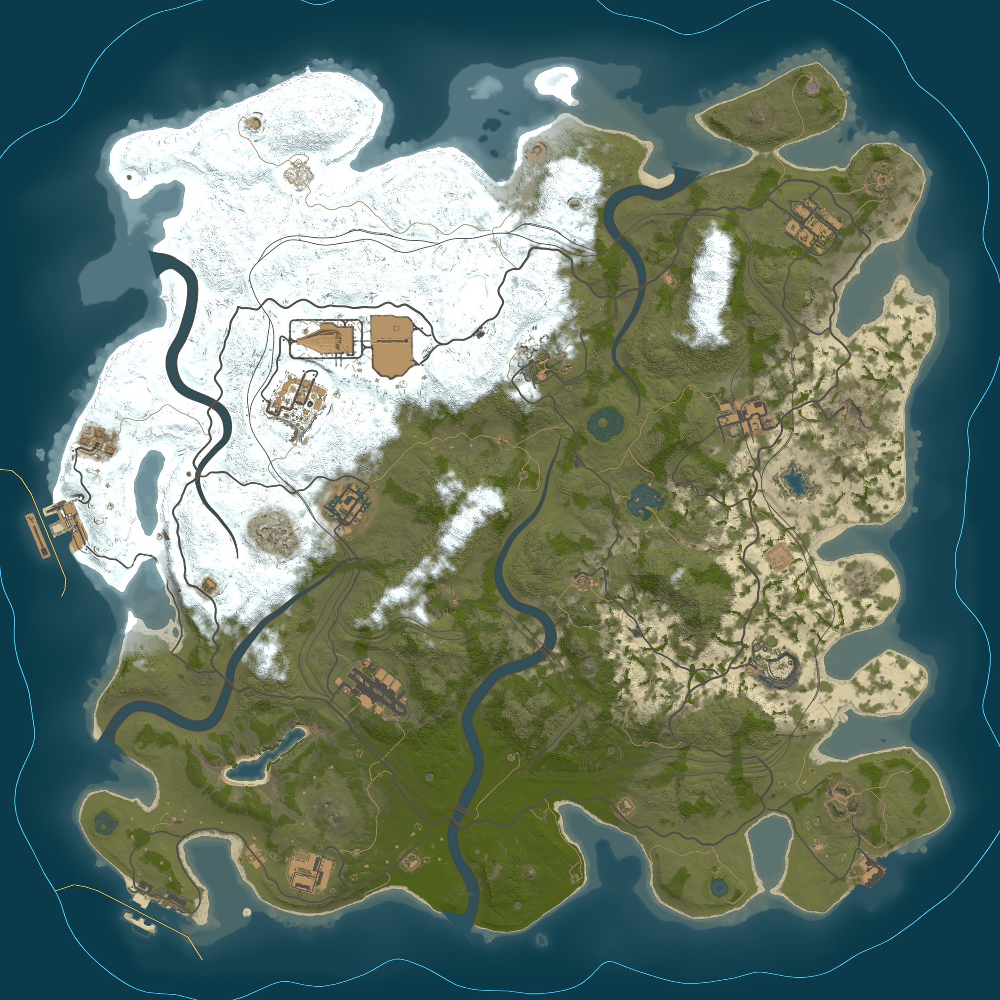

<div align="center">

# Rust Map Parser

### Decode, analyze, and render Rust `.map` files entirely from Python.

[](https://www.python.org/)
[](LICENSE)
[](#quick-start)
[](#refreshing-rust-data)

**A standalone, library-first toolkit for heatmaps, server-style terrain
renders, monuments, cargo-ship routes, train tunnels, no-build zones,
diagnostics, and map tiles.**


</div>

> [!NOTE]
> This is an independent community project. It is not affiliated with or
> endorsed by Facepunch Studios. Rust and its game assets belong to Facepunch.

## Why this project?

Rust `.map` files contain much more than a terrain image. They serialize height,
water, splat, biome, topology, path, and prefab data. Rust Map Parser turns those
layers into typed Python objects and useful artifacts without starting a game
server.

- **Choose exactly what runs** -- map only, heatmaps only, gameplay layers, or
  any custom combination.
- **Pure Python consumer API** -- no CLI, Unity editor, or running Rust server.
- **Exact heatmap data** -- named `uint8` arrays in compressed NPZ files.
- **Server-style rendering** -- a close Python port of Rust's map renderer.
- **Gameplay-aware exports** -- monuments, separate exact-interactable and
  concise-puzzle sidecars, optional compact loot and radiation sidecars, loot
  tiers, tunnels, and no-build zones.
- **Asset-free normal use** -- sanitized, versioned runtime data ships with the
  package.

## Output gallery

These images were generated from a real size-4250 Rust map.

<table>
  <tr>
    <td width="33%" align="center">
      
      <br /><strong>Underground train tunnels</strong>
    </td>
    <td width="33%" align="center">
      
      <br /><strong>Building-block exclusion zones</strong>
    </td>
    <td width="33%" align="center">
      
      <br /><strong>Ore population heatmap</strong>
    </td>
  </tr>
  <tr>
    <td colspan="3" align="center">
      
      <br /><strong>Cargo Ship path</strong>
    </td>
  </tr>
</table>

## Features

- Rust header, legacy LZ4 stream, and protobuf world decoding
- Height, terrain, water, alpha, splat, biome, and topology layers
- Paths, monuments, and placed prefab transforms
- 25 procedural population heatmaps at configurable resolution
- Raw grayscale previews and native diagnostic layers
- Half-scale and world-size server-style terrain rendering
- Optional bottom-left-indexed padded map tiles
- Exact pre-rasterized underground train-tunnel layer
- Compact monument JSON with gameplay metadata, train-tunnel entrances, and links
- Compact circle/rectangle no-build zone JSON and overlays
- Reconstructed cargo patrol loop with exact packaged harbor approach nodes
- Detailed timings, source identities, counts, and validation metadata

## Requirements and installation

- Python 3.11, 3.12, or 3.13
- A Rust `.map` file

Install the latest release from PyPI:

```powershell
pip install rust-map-parser
```

For contributors working from a cloned checkout, use an editable development
install instead:

```powershell
python -m pip install -e .
```

UnityPy and a local Rust install are not required for normal use. Maintainers
refreshing packaged game data can install the optional dependency:

```powershell
python -m pip install -e ".[assets]"
```

## Quick start

There is intentionally no command-line interface. Pick an output preset or
compose output sections in Python.

### Render only the map

```python
from pathlib import Path

from rustmap_parser import ExportConfig, ExportOptions, RustMapExporter


config = ExportConfig(
    map_path=Path(r"C:\path\to\procedural.map"),
    output_dir=Path("output/map-only"),
    exports=ExportOptions.map_only(tiles=True),
)

result = RustMapExporter(config).run()
print(result.full_map_image)
print(result.map_tiles_dir)
```

This run does not load spawn rules or generate heatmaps, diagnostics, monuments,
tunnels, no-build zones, or cargo paths.

### Generate only heatmaps

```python
config = ExportConfig(
    map_path=Path(r"C:\path\to\procedural.map"),
    output_dir=Path("output/heatmaps-only"),
    exports=ExportOptions.heatmaps_only(
        resolution=2048,
        previews=False,
    ),
)
```

### Export everything

The default remains a complete export:

```python
config = ExportConfig(
    map_path=Path(r"C:\path\to\procedural.map"),
    output_dir=Path("output/full"),
)

# Equivalent explicit form:
config = ExportConfig(
    map_path=Path(r"C:\path\to\procedural.map"),
    output_dir=Path("output/full"),
    exports=ExportOptions.all(),
)
```

`ExportOptions.all()` includes heatmaps and previews, diagnostics, monuments,
all four monument sidecars,
the full-size terrain image and 512-pixel tiles, both tunnel images, the
no-build-zone images and JSON, and the cargo patrol layer, overlay, and JSON.
The redundant scaled terrain render is skipped when the full-size render is
enabled.

### Mix exactly what you need

```python
from rustmap_parser import (
    CargoShipPathOptions,
    DiagnosticsOptions,
    ExportConfig,
    ExportOptions,
    MonumentOptions,
    NoBuildZoneOptions,
    RustMapExporter,
    TerrainOptions,
    TileOptions,
    TransformOptions,
)


config = ExportConfig(
    map_path=Path(r"C:\path\to\procedural.map"),
    output_dir=Path("output/custom"),
    exports=ExportOptions(
        diagnostics=DiagnosticsOptions(resolution=None),
        monuments=MonumentOptions(
            interactable=True,
            puzzles=True,
            loot=False,
            radiation_zones=False,
        ),
        transforms=TransformOptions(
            local_position=False,
            position=False,
            map_position=True,
        ),
        terrain=TerrainOptions(
            scale=0.5,
            formats=("png",),
            full_size=True,
            tiles=TileOptions(size=512),
        ),
        no_build_zones=NoBuildZoneOptions(
            outline_width=4,
        ),
        cargo_ship_path=CargoShipPathOptions(
            line_width=5,
            smooth_patrol=True,
        ),
    ),
    status_updates=True,
    timing_debug=True,
)

result = RustMapExporter(config).run()
```

Only map-resolution diagnostics, monument interactables, puzzles, terrain,
tiles, no-build zones, and the cargo route run in this example.
`None` disables configurable stages; `False` disables simple stages.

Use [`example.py`](example.py) for a complete editable example after installing
the package with `python -m pip install -e .`.

## The configuration model

For the complete option-by-option guide, see
**[ExportConfig in depth](docs/export-config.md)**. For every return field,
status, path guarantee, and consumption pattern, see
**[ExportResult in depth](docs/export-result.md)**.

The API separates three concerns:

```text
ExportConfig
|-- map_path / output_dir       Where data comes from and goes
|-- exports: ExportOptions      Which stages run and their settings
|-- data: DataOptions           Optional packaged-data overrides
|-- status_updates              Live stage milestone prints
`-- timing_debug                End-of-run timing table
```

`ExportOptions()` starts with every stage disabled, which makes explicit custom
combinations predictable. `ExportConfig` itself uses `ExportOptions.all()` as
its default for convenient complete exports.

Set `status_updates=True` on `ExportConfig` for concise, immediately flushed
progress prints. The exporter reports map loading, enabled stage starts and
completions, useful counts, metadata writing, and final elapsed time. It does
not print per-prefab or per-marker messages. Supporting stages that run in
parallel are reported in their actual completion order. The default is `False`,
so library use remains silent.

### Output sections

| Section | Type | Disabled value | Purpose |
|---|---|---|---|
| `heatmaps` | `HeatmapOptions` | `None` | NPZ arrays and optional previews |
| `diagnostics` | `bool` or `DiagnosticsOptions` | `False` | Decoded layer images at native, map, or explicit resolution |
| `monuments` | `bool` or `MonumentOptions` | `False` | Monument JSON and independently selected detail sidecars |
| `terrain` | `TerrainOptions` | `None` | Scaled/full terrain renders and tiles |
| `tunnels` | `TunnelOptions` | `None` | Train-tunnel layer and optional overlay |
| `no_build_zones` | `NoBuildZoneOptions` | `None` | Building exclusion layer, JSON, and overlay |
| `cargo_ship_path` | `CargoShipPathOptions` | `None` | Ocean patrol loop, harbor approaches, JSON, and images |
| `transforms` | `TransformOptions` | all enabled | Coordinate forms used by every transform-bearing JSON export |

### Option types

`HeatmapOptions`:

| Field | Default | Meaning |
|---|---:|---|
| `resolution` | `2048` | Array width/height; `None` uses the world size |
| `previews` | `True` | Write exact grayscale PNG previews |

`DiagnosticsOptions` has one field, `resolution`. `None` exports every
diagnostic PNG at `world_size × world_size`; a positive integer selects an
explicit square resolution. Plain `diagnostics=True` remains supported and
preserves each decoded layer's native resolution.

`TerrainOptions`:

| Field | Default | Meaning |
|---|---:|---|
| `scale` | `0.5` | Scaled map render size |
| `ocean_margin` | `0` | Extra ocean pixels around scaled output |
| `formats` | `("png", "jpg")` | Scaled formats used when `full_size=False` |
| `full_size` | `True` | Write only the one-pixel-per-metre render |
| `tiles` | `None` | Optional `TileOptions` |
| `debug` | `False` | Renderer debug mode |

`TunnelOptions` controls resolution, tunnel opacity, the purple-blue terrain
tint, and whether to write the transparent layer, terrain overlay, or both.
`NoBuildZoneOptions` controls
resolution, RGBA colors, outline width, and independent image/JSON output.
`CargoShipPathOptions` controls route resolution, patrol/harbor colors, line
width, patrol smoothing, and independent layer/overlay/JSON output.
A `None` resolution uses the map's world size.

`MonumentOptions.interactable=True` is opt-in. It merges
packaged vanilla child transforms with recognized prefabs serialized directly
in the map, so custom-added recyclers, research tables, and oil refineries keep
their exact positions and source identities. `interactable=True` writes those
records to a separate sidecar. `puzzles=True` writes major puzzle routes
independently; loot and radiation zones also have independent sidecars. None of
these arrays inflate `monuments/monuments.json`. Puzzle routes expose
only major fuse, switch, button, keycard, wheel, and door steps; Rust's lighting,
timer, alarm, and logic wiring stays internal. Nonstandard roots in the map's
`Monument` category are included as custom monuments whenever any monument
expansion is enabled.

Every transform-bearing JSON uses one global selection. All coordinate forms
are enabled by default. For a map-marker-only export, use:

```python
TransformOptions(
    local_position=False,  # omit prefab-relative XYZ
    position=False,        # omit Unity world XYZ
    map_position=True,     # keep bottom-left map XY
)
```

Set it once as `ExportOptions(transforms=...)`. The projection applies to
monument roots and sidecars, cargo patrol and harbor nodes, and no-build-zone
centres. It does not remove headings, rotations, loot radii, radiation shape
geometry, or the geometry needed internally to render images.

`DataOptions` can override the bundled version-matched resources:

```python
from rustmap_parser import DataOptions

config = ExportConfig(
    map_path=map_path,
    output_dir=output_dir,
    exports=ExportOptions.heatmaps_only(),
    data=DataOptions(
        spawn_rules_path=Path("custom/spawn_rules.json"),
        prefab_manifest_path=Path("custom/prefab_manifest.json"),
    ),
)
```

Only resources needed by selected stages are loaded. A map-only export never
opens the prefab manifest or spawn-rule database.

## Results and metadata

`RustMapExporter.run()` returns an `ExportResult`. Paths for disabled stages are
`None`, counts are zero, and status strings are `"disabled"`.

Common fields:

```python
result.world_size
result.elapsed_seconds
result.metadata_file       # export_metadata.json
result.heatmaps_file
result.heatmap_categories
result.full_map_image
result.map_tiles_dir
result.map_tile_count
result.monuments_file
result.monument_count
result.monument_interactables_file
result.monument_interactable_count
result.monument_puzzles_file
result.monument_puzzle_count
result.monument_loot_file
result.monument_loot_position_count
result.monument_radiation_zones_file
result.monument_radiation_zone_count
result.tunnels_image
result.tunnel_render_status
result.no_build_zones_file
result.no_build_zone_count
result.cargo_ship_path_file
result.cargo_ship_path_node_count
```

Every run writes `export_metadata.json`, a stage-neutral summary containing the
enabled-output selection, world metadata, artifacts, timings, validation data,
and per-stage results. This replaces the old heatmap-named top-level metadata
file, which was confusing for partial exports.

For privacy, `map.path` in this file contains only the input map filename. It
never stores the absolute workstation or game-server path.

Every exported PNG also contains a non-visible `Source` text metadata field
linking to `https://github.com/Cooperkit/Rustmap-Parser`. The tag does not alter
the image pixels and can be inspected with Pillow through `image.info["Source"]`.

## Output layout

A complete export resembles:

```text
output/full/
|-- export_metadata.json
|-- heatmaps.npz
|-- Heatmap-previews/
|-- diagnostics/
|-- monuments/
|   |-- monuments.json
|   |-- monument_interactables.json
|   |-- monument_puzzles.json
|   |-- monument_loot.json
|   `-- monument_radiation_zones.json
|-- map_render_full.png
|-- map_render_metadata.json
|-- map_render_tiles/          # only when TerrainOptions.tiles is enabled
|   |-- x_0_y_0.png
|   `-- tiles.json
|-- tunnels.png
|-- tunnels_on_map.png
|-- tunnels_metadata.json
|-- no_build_zones.png
|-- no_build_zones_on_map.png
|-- no_build_zones.json
|-- cargo_ship_path.png
|-- cargo_ship_path_on_map.png
`-- cargo_ship_path.json
```

Use a fresh output directory for logically different selections. The exporter
does not delete artifacts from a previous run merely because their stage is now
disabled.

## Heatmaps

Heatmaps are named `uint8[resolution, resolution]` arrays stored in one
compressed NPZ archive. Values range from 0 to 255.

```text
bear, berries, boar, chicken, corn, crocodile, flowers, hab, hemp,
horse, junkpiles, logs, modularcar, mushroom, ores, pedalbike,
potato, pumpkin, rowboat, snake, stag, tiger, wheat, wolf, wood
```

```python
import numpy as np

with np.load(result.heatmaps_file) as heatmaps:
    ores = heatmaps["ores"]
    print(ores.dtype, ores.shape, ores.max())
```

Repeated population rules and splat samples are cached without changing final
NPZ bytes.

## Server-style terrain rendering

The renderer ports Rust's ordered splat blends, height normals, lighting,
shoreline distance field, topology lookup, water depth, contrast, brightness,
and offshore color.

- With `full_size=False`, `map_render.png` / `.jpg` are convenient scaled renders.
- With `full_size=True`, only the native one-pixel-per-metre
  `map_render_full.png` is rendered; scaled outputs are skipped.
- Optional tiles crop from the in-memory full render and do not change its bytes.

Tiles use a bottom-left origin, fixed RGBA dimensions, and transparent padding
on partial top/right edges. A size-4250 map produces 81 512px tiles; size-6000
produces 144.

## Monuments

`monuments/monuments.json` includes deterministic gameplay monuments with:

- Resolved prefab path and world position
- Bottom-left `map_position` in metres
- Heading, display name, family, kind, environment, spawn group, and size class
- Safe-zone status, recycler count, keycards, puzzle type, loot tier, and one
  `maximum_radiation` value
- Optional interactable, puzzle, loot, and radiation-zone JSON sidecars
- Server-accurate train-tunnel link positions and monument-owned entrance markers
- Searchable tags

With `interactable=True`, exact interactables are written to
`monuments/monument_interactables.json` and compact major-action puzzle routes
are written separately with `puzzles=True` to
`monuments/monument_puzzles.json`; neither array inflates the main monument
document. Each entry links back through `monument_id` and the owning monument
prefab. Unassigned
custom-map interactables remain available in the interactables sidecar.

`ExportOptions.transforms` controls which coordinate objects are present across
all transform-bearing JSON outputs. The available fields are `local_position`,
`position` (Unity world coordinates), and `map_position`. Monument, cargo, and
no-build JSON documents record the chosen list in `exported_position_fields`.

The loot sidecar is grouped by owning monument prefab, then loot kind/prefab.
Every marker has readable local, Unity world, and bottom-left map positions plus
its radius. Spawn limits, timers, weights, group configuration, and summaries
are not exported. The radiation sidecar is also grouped by monument prefab and
uses the same three position forms for every zone.
Loot kinds include `diesel_fuel` for
`assets/content/structures/excavator/prefabs/diesel_collectable.prefab`,
including vanilla monument spawn choices and directly placed custom copies.

Gameplay facts come from a sanitized, build-versioned component database
bundled with the package. Train-tunnel markers use the same visible child
`LandmarkInfo` transforms that Rust+ reads on the server; users do not need
UnityPy or a Rust installation at runtime.

## Underground train tunnels

The package ships 81 sanitized final-LOD tunnel puzzle-piece PNGs rasterized at
8 pixels per metre. Normal exports need neither UnityPy nor installed Rust
assets.

- `tunnels.png` is the authoritative transparent layer.
- `tunnels_on_map.png` is written when a full terrain render is selected.
- Set `export_layer=False, export_overlay=True` for overlay-only output.
- Without terrain, tunnel export still succeeds and omits only the overlay.
- Build mismatches and missing templates are recorded instead of hidden.

Original Facepunch meshes are never shipped.

## No-build zones

No-build export represents restrictions affecting building blocks. It keeps
useful circles and rotated rectangles, removes shapes fully contained by a
larger primitive from the same owner, and excludes deployable-only volumes,
capsules, mesh blockers, and redundant internals.

Each JSON zone uses the compact coordinate fields `position`, bottom-left
`map_position`, and `heading_degrees`; normalized/image positions and verbose
Euler/scale transforms are not exported.

The transparent layer and JSON work without terrain. The composited preview is
added only when the selected terrain section includes a full-size render. Set
`export_images=False, export_json=True` for a fast JSON-only export that skips
rasterization and PNG encoding.

## Cargo-ship path

Rust does not serialize its cargo patrol loop into the `.map`. During world
setup, the server generates `TerrainMeta.Path.OceanPatrolFar` by relaxing a
circle toward the world while maintaining a 200-metre sphere-cast clearance,
then simplifies it. This package ports that ordered float32 relaxation against
the serialized terrain collider and a packaged subset of placed-prefab
colliders. The terrain projection includes shallow submerged shoals down to
three metres below sea level, while packaged high-resolution collision masks
cover route-changing world prefabs such as icebergs. Unity colliders belonging
to monuments and underwater labs are not completely recoverable from the map
file alone, so offline reconstruction is approximate around those features.

- `cargo_ship_path.png` is a transparent indexed PNG containing the patrol loop
  and harbor paths.
- `cargo_ship_path_on_map.png` is added when a matching full-size terrain render
  is selected.
- `cargo_ship_path.json` contains world and bottom-left map positions, travel
  direction, server constants, generation timings, and accuracy limitations.
- Harbor 1 and Harbor 2 use their exact 11-node prefab `BasePath` definitions,
  shipped as sanitized versioned package data.

By default, `smooth_patrol=True` simulates Rust's normal cargo movement:
decreasing waypoint order, 80-metre waypoint acceptance, eased steering and
throttle, a 2.5-degree-per-second turn limit, and an 8-metre-per-second maximum
speed. Its rounded, corner-cutting centreline matches how the ship traverses the
generated waypoints in game rather than applying an arbitrary visual filter.
Set it to `False` to export the reconstructed server-style waypoints unchanged.

Rust creates this permanent route before `ServerMgr.Initialize`, save loading,
and `SpawnHandler.InitialSpawn`. Consequently, later populations such as
floating junkpiles must not influence the reconstructed startup route. The
packaged collision masks are sanitized derived data; normal users do not need
UnityPy or a Rust installation. Build mismatches and unavailable templates are
reported in `cargo_ship_path.json` rather than silently hidden.

## Low-level parsing

Skip the exporter entirely when you only need decoded data:

```python
from rustmap_parser import load_map
from rustmap_parser.layers import biome_grid, splat_grid, topology_grid, world_height_grid

world = load_map("procedural.map")
height = world_height_grid(world)
water = world_height_grid(world, "water")
splat = splat_grid(world)
biome = biome_grid(world)
topology = topology_grid(world)
```

## Coordinates and orientation

| Space | Origin | Axes |
|---|---|---|
| Unity world | Map center | X right, Y elevation, Z up/north |
| Analytical arrays | Native `[z, x]` | No image transformation |
| Exported images | Top-left | X preserved; Z rows reversed |
| `map_position` | Bottom-left | X right, Y up, metres |
| Tile coordinates | Bottom-left | X right, Y up |

```text
map_x = world_x + world_size / 2
map_y = world_z + world_size / 2
```

For a world-size image, one metre equals one pixel. Convert bottom-left map Y
to an image row with `image_y = world_size - map_y`.

## Performance

The exporter reuses decoded layers, splat samples, shoreline data, height
normals, and rule evaluations. Independent work uses bounded threads without
duplicating the full terrain state.

Recorded size-4500 timings on the development machine:

| Selection | Wall time |
|---|---:|
| Heatmaps only, no previews | 4.49 s |
| Gameplay layers only | 2.05 s |
| Map only | 18.95 s |
| Complete export | about 27 s |

Times depend on hardware, map size, enabled outputs, and PNG compressibility.

## Refreshing Rust data

Maintainers refresh every packaged runtime resource with one script:

```powershell
python -m pip install -e ".[assets]"
python refresh_all_data.py
```

[`refresh_all_data.py`](refresh_all_data.py) stages and validates the prefab
manifest, spawn rules, monument gameplay metadata, no-build geometry, cargo
harbor paths, cargo world-collision masks, and 81 tunnel tiles. It checks Rust
build IDs, bundle identities, counts, and machine path leaks before replacing
`src/rustmap_parser/data`.

Cargo collision refreshes will only replace a directory carrying the expected
generated `tiles.json` schema and files. Filesystem roots, the home/current
directory, paths overlapping the Rust installation, symlinks, and directories
with unexpected contents are rejected before anything is removed.

The monument refresh has a separate exact-details stage. By default it uses the
same Rust installation. To source exact interactable, concise puzzle-route,
loot-spawn, Diesel Fuel, and radiation transforms from a matching dedicated
server installation, set `MONUMENT_DETAILS_INSTALL_PATH` near the top of
`refresh_all_data.py` or define `RUST_MONUMENT_DETAILS_INSTALL_PATH`. The
refresh validates those categories, their bundle provenance, and the explicit
`diesel_fuel` classification before replacing packaged data.

## Development

```powershell
$env:PYTHONPATH = "src"
python -m pytest -q
python -m build
```

The suite covers configuration, selection presets, orientation, water behavior,
no-build containment, tunnel templates, map tiles, resources, and exact output
comparisons.

## Project layout

```text
rust-map-parser/
|-- src/rustmap_parser/          # Package and implementation
|   `-- data/             # Versioned sanitized runtime resources
|-- tests/                # Unit and regression tests
|-- docs/images/          # README showcase outputs
|-- example.py            # Complete editable installed-package example
|-- refresh_all_data.py   # Unified maintainer refresh
|-- pyproject.toml
`-- LICENSE
```

## Limitations

- Runtime resources are tied to their recorded Rust build.
- Unknown custom-map prefabs are reported and skipped rather than guessed.
- Runtime-only water volumes or engine floating-point details can differ from a
  live server render.
- This repository does not include `.map` files, Facepunch source assets, or
  original extracted meshes.

## License

Original Python code is licensed under the [MIT License](LICENSE). Rust, its
formats, assets, names, and related intellectual property remain the property
of Facepunch Studios.
