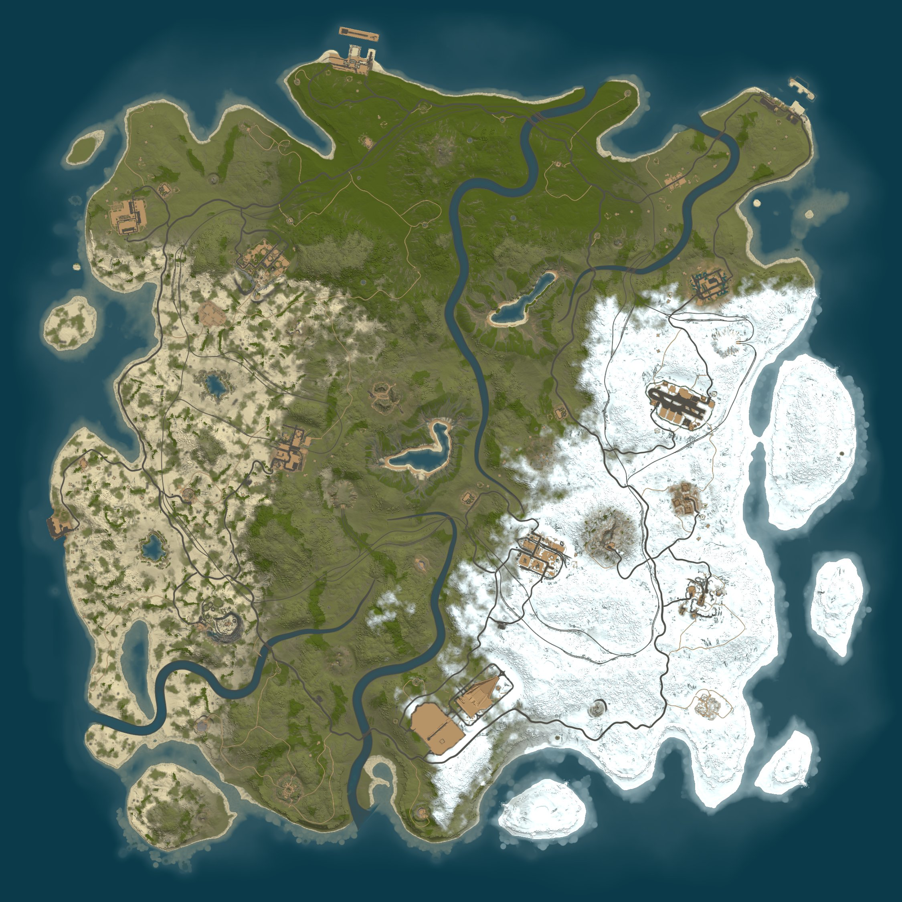
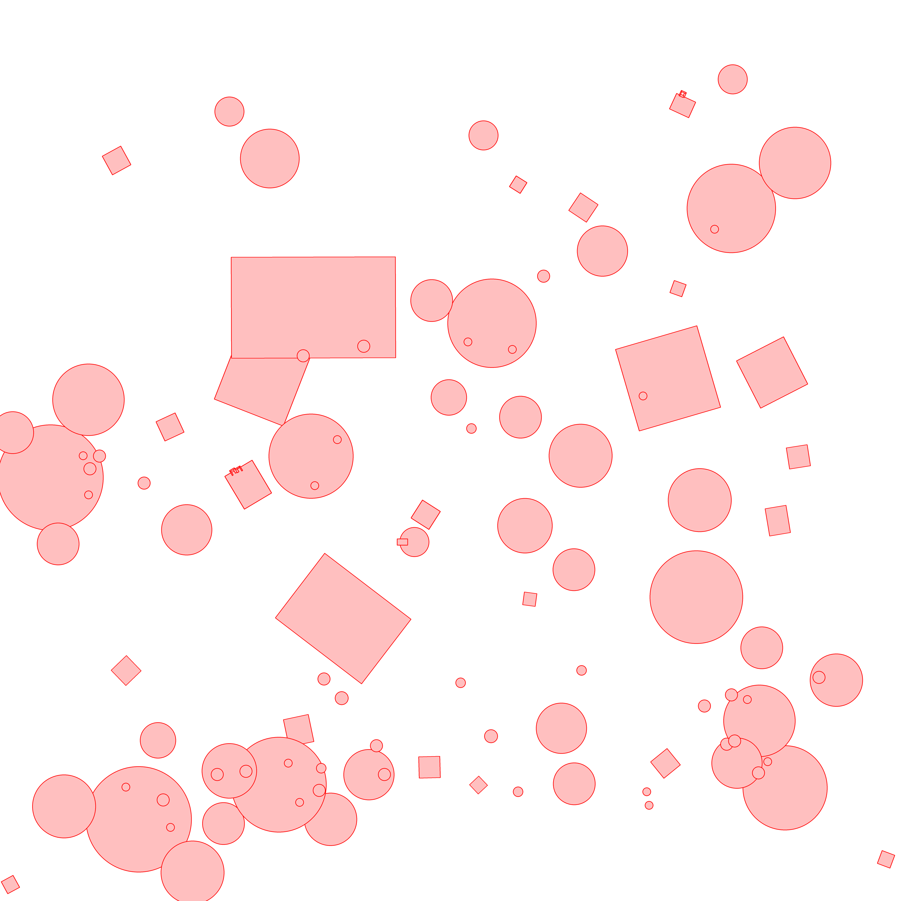
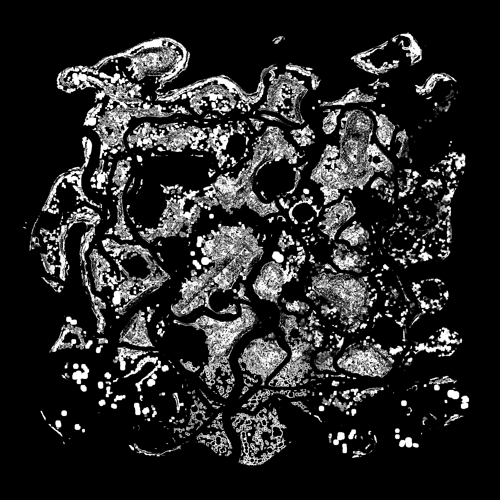

<div align="center">

# Rust Map Parser

### Decode, analyze, and render Rust `.map` files entirely from Python.

[](https://www.python.org/)
[](LICENSE)
[](#quick-start)
[](#refreshing-rust-data)

**A standalone, library-first toolkit for heatmaps, server-style terrain
renders, monuments, train tunnels, no-build zones, diagnostics, and map tiles.**



</div>

> [!NOTE]
> This is an independent community project. It is not affiliated with or
> endorsed by Facepunch Studios. Rust and its game assets belong to Facepunch.

## Why this project?

Rust `.map` files contain much more than a terrain image. They serialize height,
water, splat, biome, topology, path, and prefab data. Rust Map Parser turns those
layers into typed Python objects and useful artifacts without starting a game
server.

- **Choose exactly what runs** -- map only, heatmaps only, gameplay layers, or
  any custom combination.
- **Pure Python consumer API** -- no CLI, Unity editor, or running Rust server.
- **Exact heatmap data** -- named `uint8` arrays in compressed NPZ files.
- **Server-style rendering** -- a close Python port of Rust's map renderer.
- **Gameplay-aware exports** -- monuments, recyclers, cards, puzzles, loot tiers,
  tunnels, and no-build zones.
- **Asset-free normal use** -- sanitized, versioned runtime data ships with the
  package.

## Output gallery

These images were generated from a real size-4500 Rust map.

<table>
  <tr>
    <td width="33%" align="center">
      
      <br /><strong>Underground train tunnels</strong>
    </td>
    <td width="33%" align="center">
      
      <br /><strong>Building-block exclusion zones</strong>
    </td>
    <td width="33%" align="center">
      
      <br /><strong>Ore population heatmap</strong>
    </td>
  </tr>
</table>

## Features

- Rust header, legacy LZ4 stream, and protobuf world decoding
- Height, terrain, water, alpha, splat, biome, and topology layers
- Paths, monuments, and placed prefab transforms
- 25 procedural population heatmaps at configurable resolution
- Raw grayscale previews and native diagnostic layers
- Half-scale and world-size server-style terrain rendering
- Optional bottom-left-indexed padded map tiles
- Exact pre-rasterized underground train-tunnel layer
- Compact monument JSON with extracted gameplay metadata
- Compact circle/rectangle no-build zone JSON and overlays
- Detailed timings, source identities, counts, and validation metadata
- Correct orientation: exported images reverse rows only and never mirror X

## Requirements and installation

- Python 3.11 or newer
- A Rust `.map` file

Install the latest release from PyPI:

```powershell
pip install rust-map-parser
```

For contributors working from a cloned checkout, use an editable development
install instead:

```powershell
python -m pip install -e .
```

UnityPy and a local Rust install are not required for normal use. Maintainers
refreshing packaged game data can install the optional dependency:

```powershell
python -m pip install -e ".[assets]"
```

## Quick start

There is intentionally no command-line interface. Pick an output preset or
compose output sections in Python.

### Render only the map

```python
from pathlib import Path

from rustmap_parser import ExportConfig, ExportOptions, RustMapExporter


config = ExportConfig(
    map_path=Path(r"C:\path\to\procedural.map"),
    output_dir=Path("output/map-only"),
    exports=ExportOptions.map_only(tiles=True),
)

result = RustMapExporter(config).run()
print(result.full_map_image)
print(result.map_tiles_dir)
```

This run does not load spawn rules or generate heatmaps, diagnostics, monuments,
tunnels, or no-build zones.

### Generate only heatmaps

```python
config = ExportConfig(
    map_path=Path(r"C:\path\to\procedural.map"),
    output_dir=Path("output/heatmaps-only"),
    exports=ExportOptions.heatmaps_only(
        resolution=2048,
        previews=False,
    ),
)
```

### Export everything

The default remains a complete export:

```python
config = ExportConfig(
    map_path=Path(r"C:\path\to\procedural.map"),
    output_dir=Path("output/full"),
)

# Equivalent explicit form:
config = ExportConfig(
    map_path=Path(r"C:\path\to\procedural.map"),
    output_dir=Path("output/full"),
    exports=ExportOptions.all(),
)
```

### Mix exactly what you need

```python
from rustmap_parser import (
    ExportConfig,
    ExportOptions,
    NoBuildZoneOptions,
    RustMapExporter,
    TerrainOptions,
    TileOptions,
)


config = ExportConfig(
    map_path=Path(r"C:\path\to\procedural.map"),
    output_dir=Path("output/custom"),
    exports=ExportOptions(
        monuments=True,
        terrain=TerrainOptions(
            scale=0.5,
            formats=("png",),
            full_size=True,
            tiles=TileOptions(size=512),
        ),
        no_build_zones=NoBuildZoneOptions(
            outline_width=4,
        ),
    ),
    timing_debug=True,
)

result = RustMapExporter(config).run()
```

Only monuments, terrain, tiles, and no-build zones run in this example.
`None` disables configurable stages; `False` disables simple stages.

Use [`example.py`](example.py) for a complete editable example after installing
the package with `python -m pip install -e .`.

## The configuration model

For the complete option-by-option guide, see
**[ExportConfig in depth](docs/export-config.md)**. For every return field,
status, path guarantee, and consumption pattern, see
**[ExportResult in depth](docs/export-result.md)**.

The API separates three concerns:

```text
ExportConfig
|-- map_path / output_dir       Where data comes from and goes
|-- exports: ExportOptions      Which stages run and their settings
|-- data: DataOptions           Optional packaged-data overrides
`-- timing_debug                Console timing report
```

`ExportOptions()` starts with every stage disabled, which makes explicit custom
combinations predictable. `ExportConfig` itself uses `ExportOptions.all()` as
its default for convenient complete exports.

### Output sections

| Section | Type | Disabled value | Purpose |
|---|---|---|---|
| `heatmaps` | `HeatmapOptions` | `None` | NPZ arrays and optional previews |
| `diagnostics` | `bool` | `False` | Native decoded layer images |
| `monuments` | `bool` | `False` | Enriched gameplay monument JSON |
| `terrain` | `TerrainOptions` | `None` | Scaled/full terrain renders and tiles |
| `tunnels` | `TunnelOptions` | `None` | Train-tunnel layer and optional overlay |
| `no_build_zones` | `NoBuildZoneOptions` | `None` | Building exclusion layer, JSON, and overlay |

### Option types

`HeatmapOptions`:

| Field | Default | Meaning |
|---|---:|---|
| `resolution` | `2048` | Array width/height; `None` uses the world size |
| `previews` | `True` | Write exact grayscale PNG previews |

`TerrainOptions`:

| Field | Default | Meaning |
|---|---:|---|
| `scale` | `0.5` | Scaled map render size |
| `ocean_margin` | `0` | Extra ocean pixels around scaled output |
| `formats` | `("png", "jpg")` | Scaled formats used when `full_size=False` |
| `full_size` | `True` | Write only the one-pixel-per-metre render |
| `tiles` | `None` | Optional `TileOptions` |
| `debug` | `False` | Renderer debug mode |

`TunnelOptions` controls resolution, tunnel opacity, the purple-blue terrain
tint, and whether to write the transparent layer, terrain overlay, or both.
`NoBuildZoneOptions` controls
resolution, RGBA colors, outline width, and independent image/JSON output.
A `None` resolution uses the map's world size.

`DataOptions` can override the bundled version-matched resources:

```python
from rustmap_parser import DataOptions

config = ExportConfig(
    map_path=map_path,
    output_dir=output_dir,
    exports=ExportOptions.heatmaps_only(),
    data=DataOptions(
        spawn_rules_path=Path("custom/spawn_rules.json"),
        prefab_manifest_path=Path("custom/prefab_manifest.json"),
    ),
)
```

Only resources needed by selected stages are loaded. A map-only export never
opens the prefab manifest or spawn-rule database.

## Results and metadata

`RustMapExporter.run()` returns an `ExportResult`. Paths for disabled stages are
`None`, counts are zero, and status strings are `"disabled"`.

Common fields:

```python
result.world_size
result.elapsed_seconds
result.metadata_file       # export_metadata.json
result.heatmaps_file
result.heatmap_categories
result.full_map_image
result.map_tiles_dir
result.map_tile_count
result.monuments_file
result.monument_count
result.tunnels_image
result.tunnel_render_status
result.no_build_zones_file
result.no_build_zone_count
```

Every run writes `export_metadata.json`, a stage-neutral summary containing the
enabled-output selection, world metadata, artifacts, timings, validation data,
and per-stage results. This replaces the old heatmap-named top-level metadata
file, which was confusing for partial exports.

Every exported PNG also contains a non-visible `Source` text metadata field
linking to `https://github.com/Cooperkit/Rustmap-Parser`. The tag does not alter
the image pixels and can be inspected with Pillow through `image.info["Source"]`.

## Output layout

A complete export resembles:

```text
output/full/
|-- export_metadata.json
|-- heatmaps_2048.npz
|-- Heatmap-previews/
|-- diagnostics/
|-- monuments.json
|-- map_render_full.png
|-- map_render_metadata.json
|-- map_render_tiles/          # only when TerrainOptions.tiles is enabled
|   |-- x_0_y_0.png
|   `-- tiles.json
|-- tunnels.png
|-- tunnels_on_map.png
|-- tunnels_metadata.json
|-- no_build_zones.png
|-- no_build_zones_on_map.png
`-- no_build_zones.json
```

Use a fresh output directory for logically different selections. The exporter
does not delete artifacts from a previous run merely because their stage is now
disabled.

## Heatmaps

Heatmaps are named `uint8[resolution, resolution]` arrays stored in one
compressed NPZ archive. Values range from 0 to 255.

```text
bear, berries, boar, chicken, corn, crocodile, flowers, hab, hemp,
horse, junkpiles, logs, modularcar, mushroom, ores, pedalbike,
potato, pumpkin, rowboat, snake, stag, tiger, wheat, wolf, wood
```

```python
import numpy as np

with np.load(result.heatmaps_file) as heatmaps:
    ores = heatmaps["ores"]
    print(ores.dtype, ores.shape, ores.max())
```

Repeated population rules and splat samples are cached without changing final
NPZ bytes.

## Server-style terrain rendering

The renderer ports Rust's ordered splat blends, height normals, lighting,
shoreline distance field, topology lookup, water depth, contrast, brightness,
and offshore color.

- With `full_size=False`, `map_render.png` / `.jpg` are convenient scaled renders.
- With `full_size=True`, only the native one-pixel-per-metre
  `map_render_full.png` is rendered; scaled outputs are skipped.
- Optional tiles crop from the in-memory full render and do not change its bytes.

Tiles use a bottom-left origin, fixed RGBA dimensions, and transparent padding
on partial top/right edges. A size-4250 map produces 81 512px tiles; size-6000
produces 144.

## Monuments

`monuments.json` includes deterministic gameplay monuments with:

- Resolved prefab path and world position
- Bottom-left `map_position` in metres
- Heading, display name, family, kind, environment, spawn group, and size class
- Safe-zone status, recycler count, keycards, puzzle type, and detected loot tier
- Searchable tags

Gameplay facts come from a sanitized, build-versioned component database
bundled with the package.

## Underground train tunnels

The package ships 81 sanitized final-LOD tunnel puzzle-piece PNGs rasterized at
8 pixels per metre. Normal exports need neither UnityPy nor installed Rust
assets.

- `tunnels.png` is the authoritative transparent layer.
- `tunnels_on_map.png` is written when a full terrain render is selected.
- Set `export_layer=False, export_overlay=True` for overlay-only output.
- Without terrain, tunnel export still succeeds and omits only the overlay.
- Build mismatches and missing templates are recorded instead of hidden.

Original Facepunch meshes are never shipped.

## No-build zones

No-build export represents restrictions affecting building blocks. It keeps
useful circles and rotated rectangles, removes shapes fully contained by a
larger primitive from the same owner, and excludes deployable-only volumes,
capsules, mesh blockers, and redundant internals.

The transparent layer and JSON work without terrain. The composited preview is
added only when the selected terrain section includes a full-size render. Set
`export_images=False, export_json=True` for a fast JSON-only export that skips
rasterization and PNG encoding.

## Low-level parsing

Skip the exporter entirely when you only need decoded data:

```python
from rustmap_parser import load_map
from rustmap_parser.layers import biome_grid, splat_grid, topology_grid, world_height_grid

world = load_map("procedural.map")
height = world_height_grid(world)
water = world_height_grid(world, "water")
splat = splat_grid(world)
biome = biome_grid(world)
topology = topology_grid(world)
```

## Coordinates and orientation

| Space | Origin | Axes |
|---|---|---|
| Unity world | Map center | X right, Y elevation, Z up/north |
| Analytical arrays | Native `[z, x]` | No image transformation |
| Exported images | Top-left | X preserved; Z rows reversed |
| `map_position` | Bottom-left | X right, Y up, metres |
| Tile coordinates | Bottom-left | X right, Y up |

```text
map_x = world_x + world_size / 2
map_y = world_z + world_size / 2
```

For a world-size image, one metre equals one pixel. Convert bottom-left map Y
to an image row with `image_y = world_size - map_y`.

## Performance

The exporter reuses decoded layers, splat samples, shoreline data, height
normals, and rule evaluations. Independent work uses bounded threads without
duplicating the full terrain state.

Recorded size-4500 timings on the development machine:

| Selection | Wall time |
|---|---:|
| Heatmaps only, no previews | 4.49 s |
| Gameplay layers only | 2.05 s |
| Map only | 18.95 s |
| Complete export | about 27 s |

Times depend on hardware, map size, enabled outputs, and PNG compressibility.

## Refreshing Rust data

Maintainers refresh every packaged runtime resource with one script:

```powershell
python -m pip install -e ".[assets]"
python refresh_all_data.py
```

[`refresh_all_data.py`](refresh_all_data.py) stages and validates the prefab
manifest, spawn rules, monument gameplay metadata, no-build geometry, and 81
tunnel tiles. It checks Rust build IDs, bundle identities, counts, and machine
path leaks before replacing `src/rustmap_parser/data`.

## Development

```powershell
$env:PYTHONPATH = "src"
python -m pytest -q
python -m build
```

The suite covers configuration, selection presets, orientation, water behavior,
no-build containment, tunnel templates, map tiles, resources, and exact output
comparisons.

## Project layout

```text
rust-map-parser/
|-- src/rustmap_parser/          # Package and implementation
|   `-- data/             # Versioned sanitized runtime resources
|-- tests/                # Unit and regression tests
|-- docs/images/          # README showcase outputs
|-- example.py            # Complete editable installed-package example
|-- refresh_all_data.py   # Unified maintainer refresh
|-- pyproject.toml
`-- LICENSE
```

## Limitations

- Runtime resources are tied to their recorded Rust build.
- Unknown custom-map prefabs are reported and skipped rather than guessed.
- Runtime-only water volumes or engine floating-point details can differ from a
  live server render.
- This repository does not include `.map` files, Facepunch source assets, or
  original extracted meshes.

## License

Original Python code is licensed under the [MIT License](LICENSE). Rust, its
formats, assets, names, and related intellectual property remain the property
of Facepunch Studios.
